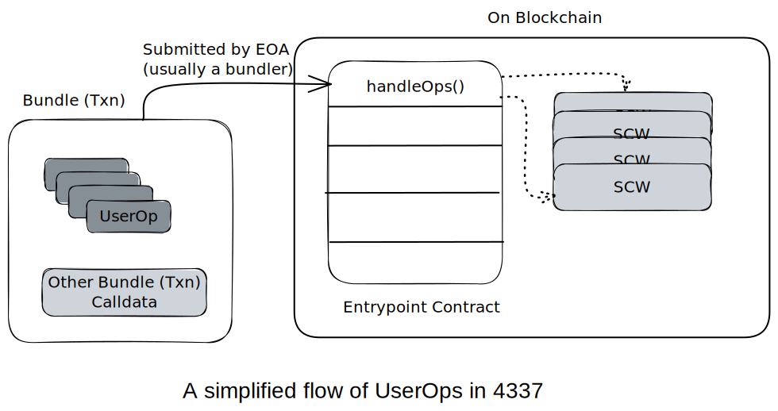
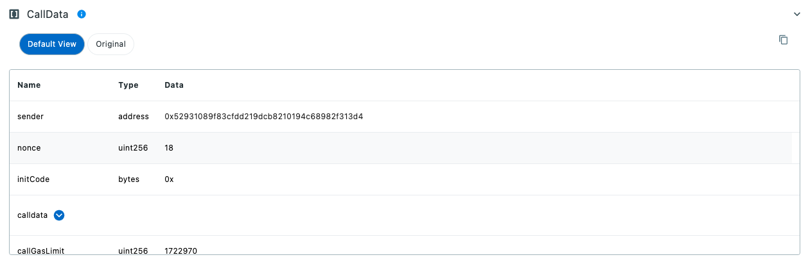
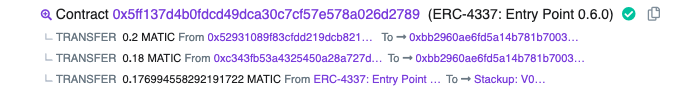

### Pre-reeds (<5 min)
---
If you're new to **Account Abstraction** or **4337**, I recommend reading these first:
- <a href="/background/Account-Abstraction" target="_blank">Why Account Abstraction</a>
- <a href="/background/eip-4337" target="_blank">What is 4337?</a>
- <a href="/glossary" target="_blank">Key Entities in 4337</a>

I assume you know what smart contracts are and how an EOA triggers a smart contract function.
 
## Introduction
---
Since [Eth Denver](https://www.ethdenver.com/) in Feb'23, crypto Twitter has gone gaga over Account Abstraction and [EIP-4337](https://eips.ethereum.org/EIPS/eip-4337)'s impact on the EVM ecosystem.

 After talking with multiple web3 devs and mentoring teams at ETH Tokyo Hackathon, we realized it's taking a good chunk of time and effort to grasp the basic concepts of 4337, causing delays in people getting their hands dirty. <br/>
We're here to create easy-to-grasp material, with no fluff or annoying tech jargon, at least not without clarifying it in an easy-to-understand manner.

So let's get started.

<!--truncate-->

## Overview
---
Anyone wishing to build on 4337, first needs to understand the actual data submitted for a 4337 transaction. This post is dedicated to achieving the same.

The tutorial is basically split into two sections:
1. Understanding the data fields representing an individual User Operations (UserOp)
2. Understanding the metadata (bundle) representing the actual on-chain transaction

### Sample Reference Transaction

We will refer to the transaction (aka bundle) **0x7ed2...204** submitted to the Polygon chain on 15th May. We chose this bundle as it has more than 1 userOp and paymasters are used. <br/>
Explore it on [PolyScan](https://polygonscan.com/tx/0x7ed286f4be6ed5d219054ae38b4fa1071befb26211c235b108472ccaabfee204)
or On [JiffyScan](https://www.jiffyscan.xyz/bundle/0x7ed286f4be6ed5d219054ae38b4fa1071befb26211c235b108472ccaabfee204?network=matic).

The two UserOp Hashes in the bundle are:
1. [0xfa44f8d690560a97b5dac43487ce98773a11c26dce6fd5fb3891ba6251d553e5](https://www.jiffyscan.xyz/userOpHash/0xfa44f8d690560a97b5dac43487ce98773a11c26dce6fd5fb3891ba6251d553e5?network=matic)
2. [0xd44c9f908422e79552878f25121a8801dcbdf0819a761d269ee337954d1debc9](https://www.jiffyscan.xyz/userOpHash/0xd44c9f908422e79552878f25121a8801dcbdf0819a761d269ee337954d1debc9?network=matic)

Now let me show you how to understand a 4337 transaction.

## Breaking down Calldata
---
The calldata, in simple terms, is the input parameters of a blockchain transaction.
UserOp is an abstract transaction, i.e., it is not natively understood by the EVM chain. Rather certain sub-fields passed in the actual blockchain transaction are recognized as UserOps by the entrypoint smart contract and smart contract wallets (SCWs).

A single blockchain transaction to the entrypoint contract can contain 1 or more UserOps. Each UserOp is independent of the others in a transaction and its success or failure doesn't depend on the ones preceding it or the ones after it. 



Thus, it would be fair to say that a `UserOp` is the atomic unit of 4337. Now, let's dissect it further.

### UserOp Fields
---
UserOp is the individual operation a smart contract wallet executes. We'll first understand its fields and their purpose and then see the value from actual UserOperations.

In the latest release of 4337 ([v0.6](https://github.com/eth-infinitism/account-abstraction/releases/tag/v0.6.0)), the entrypoint requires a UserOperation with the following fields:

```
  struct UserOperation {
      address sender;
      uint256 nonce;
      bytes initCode;
      bytes callData;
      uint256 callGasLimit;
      uint256 verificationGasLimit;
      uint256 preVerificationGas;
      uint256 maxFeePerGas;
      uint256 maxPriorityFeePerGas;
      bytes paymasterAndData;
      bytes signature;
  }
```

The fields are officially defined in [EIP-4337](https://eips.ethereum.org/EIPS/eip-4337#definitions). Though we'll like to represent them again here in slightly more friendly terms:

| Field| Type| Description|
|----------------------|---------|------------------------------------------------------------------------------------------------------------------------------------------------------------------------------------------------------------------------------------------------------------------------------------------------------------------------------------------------------------------------------------------------------------------------------------------------------------------|
| sender| address | The Smart Contract Wallet Address creating the UserOp.|
| nonce | uint256 | A number to prevent replaying the same UserOp. Usually it's a number expected to be greater than the last recorded value by the smart contract wallet.|
| initCode| bytes| If the sender is yet to be created, initCode bytes are used to first create a smart contract wallet for the given sender and then process rest of the UserOp as a normal 4337 transaction.   The first 20 bytes represents the factory contract address and rest of the bytes are calldata for the factory to deploy the SCW.|
| callData| bytes| This is the actual calldata for a function present in the sender's smart contract wallet. The structure of the calldata will depend on the specific smart contract wallet implementation by its developer. This calldata represents the actual change desired by the user, for eg: transfer tokens out of the smart contract wallet to interact with other dApp contracts.|
| callGasLimit| uint256 | The maximum amount gas units the smart contract wallet can consume for the actual execution of the calldata (the above parameter).|
| verificationGasLimit | uint256 | There are certain operational checks carried out by the entrypoint before & after the actual execution of the calldata. The maximum gas for all these operations are specified by verificationGasLimit. Some of these operations can be creating the SCW when initcode is present, confirming validness of the UserOp and paymaster's support for the UserOp and triggering postOp on paymaster to validate successful completion of the userOp and fee sponsor.|
| preVerificationGas| uint256 | A UserOp is usually validated off-chain by the bundler before including it in a bundle (a transaction) and submitting it to a node for inclusion to the blockchain. This gas represents compensation to the bundler for the same.|
| maxFeePerGas| uint256 | Gas is the unit measuring amount the of computation effort. The fee Per Gas is the amount of *wei* 1 unit of gas is costing. This fee changes as the demand to include new transactions increases/decreases. maxFeePerGas is the maximum amount of *wei* per gas unit the sender is willing to spend. This is similar to **max_fee_per_gas field** in [EIP-1559](https://eips.ethereum.org/EIPS/eip-1559))|
| maxPriorityFeePerGas | uint256 | This is similar to **max_priority_fee_per_gas** in [EIP-1559](https://eips.ethereum.org/EIPS/eip-1559) and is used to incentivize a node to include a transaction in the next block over other transactions as a limited number can be included per block.|
| paymasterAndData| bytes| There's a provision for a paymaster to sponsor the gas or the value in a UserOp. When that is the case, the first 20 bytes of this field represents the paymaster contract address and rest of the bytes are calldata for the paymaster contract to validate and sponsor the UserOp.|
| signature| bytes| This field is used for verification of the UserOp by the SCW and is usually the signature of the UserOpHash signed by the owner of SCW. (Each SCW basically has an EOA owner which the wallet creator has abstracted from the flow).|

You can see the calldata values for each [UserOp](#reference-transaction) on the JiffyScan Explorer by going down to the ***developer details*** and expanding the ***CallData*** row:



<p align = "center">
<b>Calldata for UserOp Hash <a href="https://www.jiffyscan.xyz/userOpHash/0xfa44f8d690560a97b5dac43487ce98773a11c26dce6fd5fb3891ba6251d553e5?network=matic">0xfa4...3e5</a></b>
</p>


### Understanding Bundle
The *Bundle* represents a single on-chain transaction, containing one or more UserOps. It is a typical on-chain EVM transaction invoking the ```handleOps()``` function of the entrypoint smart contract, and is usually triggered by EOA. A bundler generally does this, in order to first validate the correctness of a UserOp, and to package multiple UserOps from different users into one to save gas costs. Though it could be as simple as a EOA invoking the function directly with the required calldata.

As the 4337 matures & picks up adoption, the bundler is expected to sponsor gas on behalf of multiple UserOps in a single bundle. During the execution of a bundle, the entrypoint contract collects the promised gas fee from SCW or sponsoring paymaster and holds it during execution of the bundle. At the end of the bundle, all the gas fee collected from the UserOps is transferred to an address the bundler specifies. 

| Field| Type| Description|
|-|-|-|
|(sender, initCode, ...., signature)[]|Array`<UserOperation>`| A list of Fields shown in the UserOperation Struct above representing all the UserOps to execute in the current bundle|
|beneficiary|address|The gas fee collected from the sender SCW is transferred to this address. Currently it's the same address as that of the EOA used by the bundler|

Let's see what happened in our [reference bundle](#reference-transaction) above:


<p align = "center">
<b>4337 Bundle Internal Txns as shown on <a href="https://polygonscan.com/tx/0x7ed286f4be6ed5d219054ae38b4fa1071befb26211c235b108472ccaabfee204">polyscan</a></b>
</p>

Here, there are two UserOps, both successful shown by the first two transfer calls of 0.2 MATIC and 0.18 MATIC respectively. Then there's a third internal transaction transferring 0.17699 MATIC to the beneficiary, which, in this case, is the [Stackup](https://www.stackup.sh/)'s bundler itself.

## What's Next
Try submitting a UserOp yourself. Resources listed at [awesome-account-abstraction](https://github.com/4337Mafia/awesome-account-abstraction) can help you explore further.

Remember you can use the [JiffyScan](https://app.jiffyscan.xyz/) interface to share your UserOps with your friends and community.

Also, if you need real-time data on 4337, do check out our leading [API](https://jiffyscan.readme.io/reference/getting-started-1).

We will be releasing more deep dives, walkthroughs, and quickstart tutorials for 4337 regularly in the coming weeks. Follow me on [Twitter](https://twitter.com/artsofbaniya) or [JiffyScan](https://twitter.com/JiffyScan) to stay updated. 