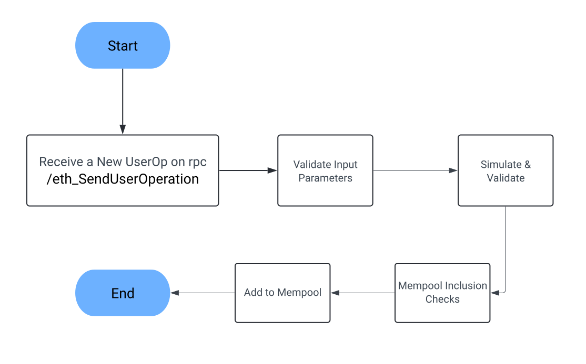

## Introduction
---
Why is a bundler needed? What is it exactly doing to a UserOperation? We continue our [EIP-4337](https://eips.ethereum.org/EIPS/eip-4337) journey. This time by clearing out what a UserOperation typically goes through in a bundler.

<!--truncate-->

After publishing the previous post detailing [UserOperation CallData](../2023-05-17-decoding-4337-calldata/index.md), a few folks reached out asking ***Exactly why is a BUNDLER needed if I can just relay the UserOp to the entrypoint from an EOA***. 

Let's break down the checks a bundler performs upon receiving a UserOp through its RPC URL.

**
Would like to thank the [Ethereum Foundation](https://ethereum.foundation/) and [ERC4337 community](https://www.erc4337.io/) for their support. JiffyScan and these articles wouldn't have existed without their aid.
**

## Overview
---

The job of a bundler is to accept signed calldata representing a UserOperation and submit it to the chain (`triggering  entrypoint.handleOps()`), potentially along with other independent UserOperations.

We break down this process in this post into 2 phases:
1. **[Pre-Bundling Phase](#pre-bundling-phase):** Validating a UserOperation before adding it to the pool of UserOperations ready to create a bundle
2. **[Bundling Phase](#bundling-phase):** Submitting a subset from the UserOperations pending to be added to the chain

Note: We've used [Eth-infinitism's bundler](https://github.com/eth-infinitism/bundler/tree/2bf049a9df57fc4d355d033db32712adba815474/packages/bundler) as a reference for this post.

## Pre-Bundling Phase
---

When a UserOperation is received by the [bundler's RPC endpoint](https://github.com/eth-infinitism/bundler/blob/2bf049a9df57fc4d355d033db32712adba815474/packages/bundler/src/BundlerServer.ts#L167), it runs a few checks before adding it to the set of valid UserOperations to be ready to be submitted to the chain. The checks are carried out in the following stages:

1. [Validate Input Parameters](#validate-input-parameters)
2. [Simulate UserOp and Validate the trace](#simulate-userop--validate-the-trace)
3. [Perform Mempool level checks](#perform-mempool-level-checks)

<b>Steps while adding UserOp to the Mempool</b>

### Validate Input Parameters
---
Bundler checks for the presence & validity of all the [fields of a UserOp](../2023-05-17-decoding-4337-calldata/index.md) at an individual level. These are as follows:
1. The entrypoint parameter in the RPC call is not null and is supported by the bundler
2. UserOperation is not null and all the fields have hexadecimal values:
	- Sender
	- nonce
	- initCode
	- callData
	- paymasterAndData
	- signature (if required)
3. UserOperations has all the gas parameters and the values are valid hexadecimal values:
	- preVerificationGas
	- verificationGasLimit
	- callGasLimit
	- maxFeePerGas
	- maxPriorityFeePerGas
4. The paymasterAndData field is either `0x` or the length is greater than or equal to `42` (to store at least an address)
5. The initCode field is either `0x` or the length is greater than or equal to `42` (to store at least an address)
6. Ensure `preVerificationGas` is the minimum [required by the bundler](https://github.com/eth-infinitism/bundler/blob/2bf049a9df57fc4d355d033db32712adba815474/packages/sdk/src/calcPreVerificationGas.ts#L61) to process the request.

You may refer to the code to [validate input parameters here](https://github.com/eth-infinitism/bundler/blob/65f56cfc9c739b594279469de924730517209244/packages/bundler/src/modules/ValidationManager.ts#L255). For some reason, steps 1-3 are performed once before redundantly [here](https://github.com/eth-infinitism/bundler/blob/2bf049a9df57fc4d355d033db32712adba815474/packages/bundler/src/UserOpMethodHandler.ts#L71) in the v1.6 of the Eth-infinitism's bundler implementation.

### Simulate UserOp and Validate the trace
---
The bundler next checks the changes the operation would've on the state of the blockchain and that it meets the restrictions suggested by the standard.

This is achieved by using `debug_tracecall` offered by certain node providers, the dominant being [by geth](https://geth.ethereum.org/docs/interacting-with-geth/rpc/ns-debug#debugtracecall). It allows you to simulate a transaction on the latest state of the blockchain and collect any information related to addresses, opcodes involved, memory accessed, value transferred, etc. that one is interested in. 

:::info
A tracer is a javascript program passed in the **debug_tracecall** API call specifying the information you want to collect and receive in the response. You can see the script used in the current implementation [here](https://github.com/eth-infinitism/bundler/blob/2bf049a9df57fc4d355d033db32712adba815474/packages/bundler/src/BundlerCollectorTracer.ts#L110).
:::

The steps in this stage are as follows:
1. **[Simulate the UserOp](https://github.com/eth-infinitism/bundler/blob/65f56cfc9c739b594279469de924730517209244/packages/bundler/src/modules/ValidationManager.ts#L111) and generate the validation result and trace output**:
	- entrypoint's `simulateValidation()` method is invoked for this.
	- Any return value apart from `REVERT` is invalid.
	- Additional logic checks whether the data returned is a genuine result or an error and handles it accordingly
2. **[Parse Trace Result](https://github.com/eth-infinitism/bundler/blob/2bf049a9df57fc4d355d033db32712adba815474/packages/bundler/src/parseScannerResult.ts#L172)** to ensure no security compromises are made and the bundler can not be cheated out of being reimbursed for gas:
	- There's at least one call from the entrypoint
	- No illegal calls are made to the entrypoint from an external contract
	- A `CALL` is not made without specifying a value to an external contract
	- A [banned opcode](https://github.com/eth-infinitism/bundler/blob/2bf049a9df57fc4d355d033db32712adba815474/packages/bundler/src/parseScannerResult.ts#L178) is not used
	- There's only one `CREATE2` call from the factory address
	- No entity apart from Factory uses a `CREATE2` opcode
	- An unstaked entity is not accessing forbidden storage slots of external contracts/accounts
	- All the referenced contracts have code deployed unless it's the sender of the UserOp
3. Perform validity of additional meta parameters:
	- Both UserOp and Paymaster Signature are valid
	- `validAfter` is in the past
	- `validUntil` is either `null` or in the future
	- the `validUntil` is sufficiently in the future to not expire while being added to the chain

These complete the bulk of the checks needed to accept a UserOp.

### Perform Mempool level checks
---
After initial validation, the bundler proceeds to [add UserOperation](https://github.com/eth-infinitism/bundler/blob/2bf049a9df57fc4d355d033db32712adba815474/packages/bundler/src/modules/MempoolManager.ts#L65) to the valid pool which can be submitted to the chain next time it's ready to do so.

The checks performed at this stage depend on whether a previous UserOperation with the same `nonce` and `sender` exists already or not:
1. **Found a pending UserOp from the same `sender` with the same `nonce` value:**
	- It's a straightforward check that the new operation gives sufficient incentive to replace the previous UserOp. In the reference implementation, the old UserOp is replaced if the `maxPriorityFeePerGas` & `maxFeePerGas` values are 1.1 times more in the new UserOp.
2. **No Existing UserOp with the same `sender` & `nonce` value found**: 
	- The reputation Status of the account, paymaster, factory & aggregator are checked first.
	- The entities shouldn't be banned, throttled, or exceed the maximum allowed UserOps from an unstaked entity.
	- The `sender` address shouldn't be present as the `factory` or `paymaster` for another UserOp in the Mempool
	- The `factory` or `paymaster` addresses shouldn't be present as `sender` for another UserOp in the Mempool

## Bundling Phase
---
Depending on the bundler, certain conditions will trigger the bundler to package the pending UserOps from the pool in a bundle and add them to the chain. The trigger condition could be as simple as submitting every UserOp to the chain the moment it is added to the mempool to wait for a certain period or cumulative `gasFee` reward from UserOps.

Due to the delay, UserOps could become invalid, thus being dropped or never being added to a bundle.

In this section, we break down what happens when a bundler decides to create a new bundle from the pool of pending UserOps.

<b>Steps while adding UserOp to the Mempool</b>

### Create Bundle Checks
---
The process to select UserOperations into the next bundle is as follows:
1. Sort the pending UserOps in decreasing order of incentive. In the [reference implementation](https://github.com/eth-infinitism/bundler/blob/2bf049a9df57fc4d355d033db32712adba815474/packages/bundler/src/modules/MempoolManager.ts#L196), UserOperations are sorted based on the `maxPriorityFeePerGas` value.
2. Each UserOperation in the sorted list is iterated over. While iterating, the following checks are made:
	- If the `paymaster` or `factory` is banned, the UserOperation is dropped from the mempool
	- If the `paymaster` or `factory` has been throttled to limit the number of UserOperations from them, the UserOperation is skipped for the current bundle
	- If there's already a UserOperation from the same `sender` added to the bundle in the previous iterations, the UserOperation is skipped for the current bundle.
	- The UserOperation is again validated by [simulating it](#simulate-userop--validate-the-trace). If the simulation fails now, the UserOperation is dropped from the pool
	- If the UserOperation accesses the storage of a `sender` from the UserOperations already included from previous iterations, it is skipped
	- If the cumulative gas from all the UserOps accepted so far is less than the maximum Gas the bundle can have, skips the current UserOperation and stops iterating over the remaining ones.
	- Skips the UserOperation if the `paymaster` balance is not sufficient to sponsor all the UserOperations if the current is also added to the bundle

The UserOps selected after the iteration process ends are added to a bundle and sent as a transaction to the entrypoint to be added to the chain and later removed from the mempool.

## What's Next
Try running a bundler yourself. You can try the [Eth-Infinitism Bundler](https://github.com/eth-infinitism/bundler/tree/main) to get started.

Remember you can use the [JiffyScan](https://app.jiffyscan.xyz/) interface to share your UserOps with your friends and community.

Also, if you need real-time data on 4337, do check out our leading [API](https://jiffyscan.readme.io/reference/getting-started-1).

We will be releasing more deep dives, walkthroughs, and quickstart tutorials for 4337 regularly in the coming weeks. Follow me on [Twitter](https://twitter.com/artsofbaniya) or [JiffyScan](https://twitter.com/JiffyScan) to stay updated. 