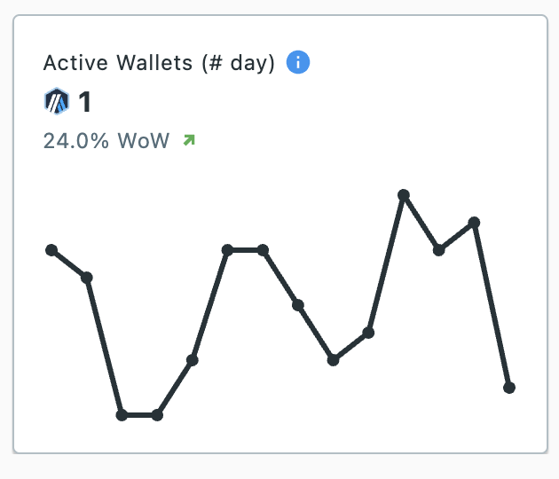

The Active Wallets chart shows the unique number of wallets submitting atleast one operation on the selected chain for the last 14 days.  
It also shows the % change in total number of unique active wallets in the last 7 days vs the 7 days before that.

