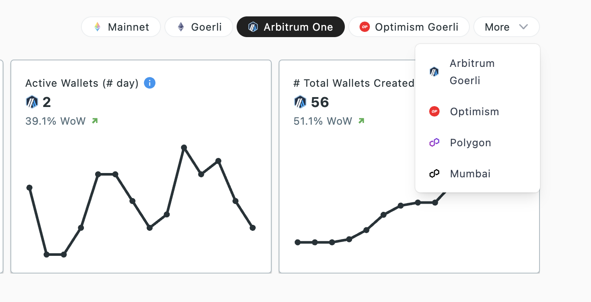

Jiffyscan supports multiple mainnets and testnets. Few are always fixed on the top, while the rest can be accessed from the dropdown shown upon clicking `More`.  
Once a chain is selected, your preference in stored on your local machine. Next visit to JiffyScan will initialize using this local state if found and nothing is explicitly specified in the url.

When there is no local state found and no supported network is specified in the request parameters, jiffyscan defaults to ethereum mainnet.

